<h1>
HQTrivia Question Dumper
</h1>

This is a Python 3.0+ (tested on 3.6) script to dump all the HQTrivia questions available on HQBuff. It is based on their API used to dynamically build HQBuff pages when you browse them.

This is the general API layout:

Example to fetch the game held on 2018-09-01, country code us:

    https://hqbuff.com/api/us/2018-09-01

Script features:

 - Default worker threads : cpu count * 2
 - Uses 5 worker threads if cpu count is None
 - Multiple parallel requests using concurrent.futures.ThreadPoolExecutor
 - Takes 18 seconds to dump the whole us game questions on Ubuntu vm with 2 cores and 10 worker threads (about 45 with 4)
 
 
 How to use:
 

    python3 hq_data_dumper.py -c us

A file called hq_game_dump_us.json will be created next to the script in the same folder

How to load and parse the json file:

    file = open('./hq_game_dump_us.json', 'r')
	hq_data = json.load(file)

	for day in hq_data:
	    for game in day:
	        for question in game['questions']:
	            print(question['text'])

				
				

 
  
Sample game output:

   
 {
            "active": false,
            "has_final_question": true,
            "game_number": 1,
            "prize": "1,000",
            "start_time": "2018-11-15T00:00:00Z",
            "direct_link": "/us/game/2018-11-14/1",
            "summary": {
                "winner_count": "402",
                "prize": "2.49",
                "currency": "$"
            },
            "countries": [
                {
                    "name": "the United States",
                    "code": "us"
                }
            ],
            "questions": [
                {
                    "direct_link": "/us/game/2018-11-14/1/1",
                    "text": "When a quarterback takes the snap and lunges across the line of scrimmage, it’s called a “QB” what?",
                    "eliminated": "17,209",
                    "advancing": "127,437",
                    "question_number": 1,
                    "question_count": 12,
                    "category": "Sports",
                    "savage": false,
                    "category_slug": "sports",
                    "answers": [
                        {
                            "text": "Sneak",
                            "correct": true,
                            "count": "127,437"
                        },
                        {
                            "text": "Peek",
                            "correct": false,
                            "count": "6,370"
                        },
                        {
                            "text": "Yeet",
                            "correct": false,
                            "count": "1,631"
                        }
                    ]
                },
                {
                    "direct_link": "/us/game/2018-11-14/1/2",
                    "text": "Which kind of golf club is designed to hit the ball with the highest launch angle?",
                    "eliminated": "57,623",
                    "advancing": "71,214",
                    "question_number": 2,
                    "question_count": 12,
                    "category": "Sports",
                    "savage": false,
                    "category_slug": "sports",
                    "answers": [
                        {
                            "text": "Long iron",
                            "correct": false,
                            "count": "6,828"
                        },
                        {
                            "text": "Driver",
                            "correct": false,
                            "count": "46,417"
                        },
                        {
                            "text": "Wedge",
                            "correct": true,
                            "count": "71,214"
                        }
                    ]
                },
                {
                    "direct_link": "/us/game/2018-11-14/1/3",
                    "text": "Who is this year’s American League Manager of the Year?",
                    "eliminated": "42,356",
                    "advancing": "32,655",
                    "question_number": 3,
                    "question_count": 12,
                    "category": "Sports",
                    "savage": true,
                    "category_slug": "sports",
                    "answers": [
                        {
                            "text": "Alex Cora",
                            "correct": false,
                            "count": "33,136"
                        },
                        {
                            "text": "Bob Melvin",
                            "correct": true,
                            "count": "32,655"
                        },
                        {
                            "text": "Kevin Cash",
                            "correct": false,
                            "count": "6,953"
                        }
                    ]
                },
                {
                    "direct_link": "/us/game/2018-11-14/1/4",
                    "text": "Spud Webb was the shortest player in NBA history to do what?",
                    "eliminated": "7,334",
                    "advancing": "28,301",
                    "question_number": 4,
                    "question_count": 12,
                    "category": "Sports",
                    "savage": false,
                    "category_slug": "sports",
                    "answers": [
                        {
                            "text": "Lead league in rebounds",
                            "correct": false,
                            "count": "2,927"
                        },
                        {
                            "text": "Win a dunk contest",
                            "correct": true,
                            "count": "28,301"
                        },
                        {
                            "text": "Be drafted in 1st round",
                            "correct": false,
                            "count": "3,468"
                        }
                    ]
                },
                {
                    "direct_link": "/us/game/2018-11-14/1/5",
                    "text": "Who is the only player to hit 15 home runs and strike out 50 batters in a single MLB season?",
                    "eliminated": "16,265",
                    "advancing": "12,357",
                    "question_number": 5,
                    "question_count": 12,
                    "category": "Sports",
                    "savage": false,
                    "category_slug": "sports",
                    "answers": [
                        {
                            "text": "Shohei Ohtani",
                            "correct": true,
                            "count": "12,357"
                        },
                        {
                            "text": "Babe Ruth",
                            "correct": false,
                            "count": "11,364"
                        },
                        {
                            "text": "Wes Ferrell",
                            "correct": false,
                            "count": "2,707"
                        }
                    ]
                },
                {
                    "direct_link": "/us/game/2018-11-14/1/6",
                    "text": "The NFL’s all-time leader in head coaching victories has NOT coached for which of these teams?",
                    "eliminated": "7,302",
                    "advancing": "6,580",
                    "question_number": 6,
                    "question_count": 12,
                    "category": "Sports",
                    "savage": false,
                    "category_slug": "sports",
                    "answers": [
                        {
                            "text": "Colts",
                            "correct": false,
                            "count": "3,571"
                        },
                        {
                            "text": "Dolphins",
                            "correct": false,
                            "count": "3,303"
                        },
                        {
                            "text": "Patriots",
                            "correct": true,
                            "count": "6,580"
                        }
                    ]
                },
                {
                    "direct_link": "/us/game/2018-11-14/1/7",
                    "text": "What school has the longest active streak of appearances in the NCAA Men’s Basketball Tournament?",
                    "eliminated": "2,912",
                    "advancing": "4,528",
                    "question_number": 7,
                    "question_count": 12,
                    "category": "Sports",
                    "savage": false,
                    "category_slug": "sports",
                    "answers": [
                        {
                            "text": "Michigan State",
                            "correct": false,
                            "count": "1,345"
                        },
                        {
                            "text": "Kansas",
                            "correct": true,
                            "count": "4,528"
                        },
                        {
                            "text": "Gonzaga",
                            "correct": false,
                            "count": "1,435"
                        }
                    ]
                },
                {
                    "direct_link": "/us/game/2018-11-14/1/8",
                    "text": "What woman overcame polio to win Olympic gold in the 100, 200, and 4x100 meter relay?",
                    "eliminated": "2,218",
                    "advancing": "2,763",
                    "question_number": 8,
                    "question_count": 12,
                    "category": "Sports",
                    "savage": false,
                    "category_slug": "sports",
                    "answers": [
                        {
                            "text": "Wilma Rudolph",
                            "correct": true,
                            "count": "2,763"
                        },
                        {
                            "text": "Florence Griffith Joyner",
                            "correct": false,
                            "count": "1,168"
                        },
                        {
                            "text": "Gail Devers",
                            "correct": false,
                            "count": "941"
                        }
                    ]
                },
                {
                    "direct_link": "/us/game/2018-11-14/1/9",
                    "text": "Instead of flipping a coin, an English soccer ref was recently suspended for having players do what?",
                    "eliminated": "835",
                    "advancing": "2,294",
                    "question_number": 9,
                    "question_count": 12,
                    "category": "Sports",
                    "savage": false,
                    "category_slug": "sports",
                    "answers": [
                        {
                            "text": "Play rock/paper/scissors",
                            "correct": true,
                            "count": "2,294"
                        },
                        {
                            "text": "Guess a number",
                            "correct": false,
                            "count": "496"
                        },
                        {
                            "text": "Thumb wrestle",
                            "correct": false,
                            "count": "300"
                        }
                    ]
                },
                {
                    "direct_link": "/us/game/2018-11-14/1/10",
                    "text": "Who scored at even strength, shorthanded, power play, in an empty net, and by penalty shot in one NHL game?",
                    "eliminated": "865",
                    "advancing": "1,596",
                    "question_number": 10,
                    "question_count": 12,
                    "category": "Sports",
                    "savage": false,
                    "category_slug": "sports",
                    "answers": [
                        {
                            "text": "Alex Ovechkin",
                            "correct": false,
                            "count": "406"
                        },
                        {
                            "text": "Wayne Gretzky",
                            "correct": false,
                            "count": "409"
                        },
                        {
                            "text": "Mario Lemieux",
                            "correct": true,
                            "count": "1,596"
                        }
                    ]
                },
                {
                    "direct_link": "/us/game/2018-11-14/1/11",
                    "text": "What was the most recent World Series between two teams with no prior championships in franchise history?",
                    "eliminated": "1,074",
                    "advancing": "705",
                    "question_number": 11,
                    "question_count": 12,
                    "category": "Sports",
                    "savage": false,
                    "category_slug": "sports",
                    "answers": [
                        {
                            "text": "Phillies / Royals",
                            "correct": true,
                            "count": "705"
                        },
                        {
                            "text": "Blue Jays / Braves",
                            "correct": false,
                            "count": "574"
                        },
                        {
                            "text": "Mets / Orioles",
                            "correct": false,
                            "count": "315"
                        }
                    ]
                },
                {
                    "direct_link": "/us/game/2018-11-14/1/12",
                    "text": "Who has the record for most consecutive shots made in a round in the NBA Three-Point Shootout?",
                    "eliminated": "530",
                    "advancing": "402",
                    "question_number": 12,
                    "question_count": 12,
                    "category": "Sports",
                    "savage": false,
                    "category_slug": "sports",
                    "answers": [
                        {
                            "text": "Devin Booker",
                            "correct": false,
                            "count": "249"
                        },
                        {
                            "text": "Larry Bird",
                            "correct": false,
                            "count": "273"
                        },
                        {
                            "text": "Craig Hodges",
                            "correct": true,
                            "count": "402"
                        }
                    ]
                }
            ]
        }

 
 
